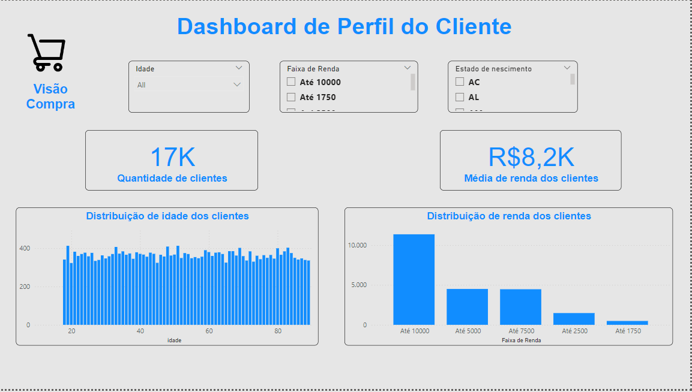

# Dashboard E-commerce utilizando Power BI
## Sumário

* [Sobre o projeto](#sobre-o-projeto)
* [Linguagens e tecnologias usadas](#linguagens-e-tecnologias-usadas)
* [Passo a passo da construção do Dashboard](#passo-a-passo-da-construção-do-dashboard)
* [Conclusões](#conclusões)

## Sobre o projeto

Este projeto tem como objetivo criar um modelo de previsão para os resultados de faturamento de um e-commerce usando Power BI. Através da análise de dados históricos de vendas e informações dos clientes, o projeto busca fornecer insights valiosos para melhorar as estratégias de vendas e alavancar os resultados da empresa. Esse é um projeto de portfólio, que também tem como objetivo colocar em prática, bem como documentar, alguns dos meus conhecimentos com a ferramenta.

**Desafio:** O objetivo é construir um painel gerencial que permita à equipe ne negócios visualizar e analisar métricas-chave para tomar decisões estratégicas. Opainel será dividido em duas páginas:

1.**Visão dos Clientes**

2.**Visão das Compras**

## Linguagens e tecnologias usadas

* Power BI
* Excel

## Passo a passo da construção do Dashboard

* **Passo 1: Importar a base de dados**

    1.**Base de Dados de Compras:** Contém informações detalhadas sobre as compras realizadas.

    2.**Base de Dados de Clientes:** Fornece informações sobre os clientes.

* **Passo 2: Tratamento de dados com o Power Query**

  Nesse ambiente nós vamos fazer os tratamentos necessários na base de dados para que ela fique correta para utilizarmos no Power BI.

  Muitas vezes o Power BI acaba importando colunas em branco, por isso é bom clicar na opção "Transformar Dados", pode haver esses ou outros problemas. Como não há nenhuma informação na coluna, o melhor a se fazer é deletar essa coluna para não atrapalhar as nossas análises.

  Também é comum que a base de dados tenha linhas em branco, para excluí-las.

* **Passo 3: Etapas de Desenvolvimento do Dashboard**

  **Etapa 01: Cartões**

  1. Analisar as tabelas recebidas no Excel, entender as colunas e os valores.
  2. Criar um cartão para:
    - Quantidade de vendas
    - Valor total de vendas sem frete
    - Valor total de vendas com frete
    - Quantidade de clientes
    - Média de renda dos clientes

  **Etapa 02: Gráficos de Linhas**

  1. Contagem de vendas por mês
  2. Valor total de vendas por mês

  **Etapa 03: Gráficos de Barras**

  1. Quantidade de vendas por categoria
  2. Valor total de vendas por categoria
  3. Distribuição de idades dos clientes
  4. Distribuição de renda dos clientes

  **Etapa 04: Filtros**

  1. Bandeira
  2. Estado
  3. Canal de venda
  4. Departamento
  5. Idade
  6. Faixa de renda
  7. Estado de nascimento

## Conclusões

O Dashboard construído ficou da seguinte maneira:

  

 

  

